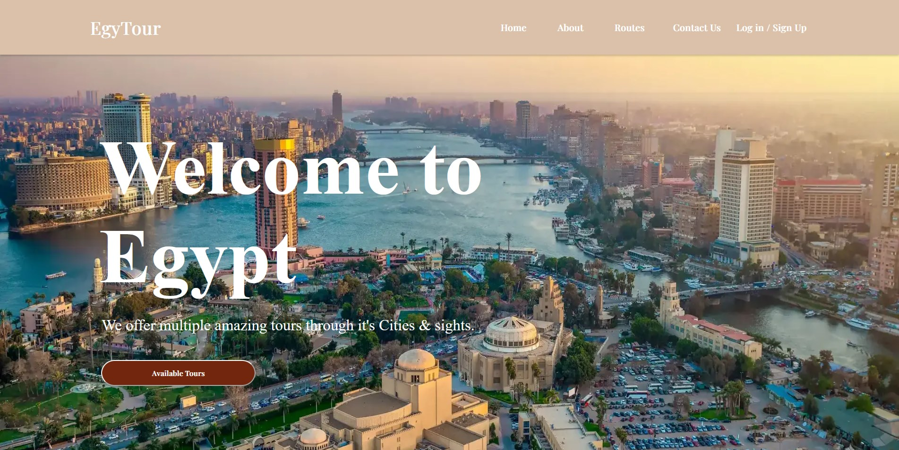

<h2 align="center"><u>Egypt-Tour</u></h2>

<h4 align="center"> Modern Tour Provider </h4>

 

    
    
    
    
    

 

### [📃] Description
EgyTour is a Website that represents a mockup for booking tours in Egypt.

### [⬇️] Installation
 - `git clone https://github.com/bananenman/egypt-tour.git`
 - `cd egypt-tour`
 - `npm run dev`

### [📋] Features
 - Geolocation via geoapify
 - Daily changing prices

